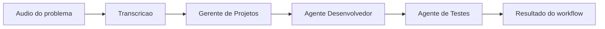
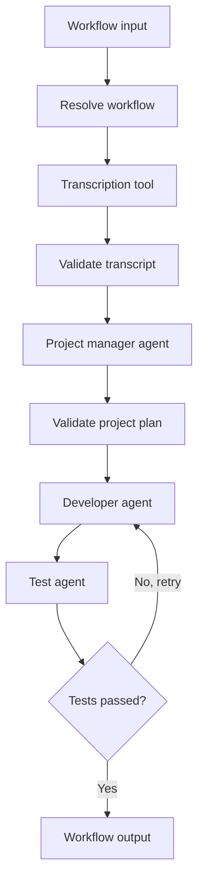

# Workflows multiagente

## 1. Objetivo

Permitir que o usuario monte um fluxo de agentes especializados que colaboram para resolver um problema maior. Cada etapa do fluxo recebe uma entrada, executa um agente ou uma tool e entrega um artefato para a proxima etapa.

Exemplo de fluxo:



O objetivo nao e transformar todos os casos em uma cadeia fixa. O builder deve permitir fluxos lineares, ramificacoes, validacoes, repeticoes e pontos de aprovacao humana.

## 2. O que ja existe no repositorio

A base atual ja possui componentes importantes:

- `AgentDefinition` representa a configuracao de um agente.
- `GraphBuilder` transforma uma definicao em um grafo LangGraph.
- `AgentRuntime` executa o ciclo `memory -> plan -> act -> reflect`.
- `ToolRegistry` registra e executa tools locais ou sandboxed.
- `DockerToolSandbox` isola tools em containers sem rede e com limites de recursos.
- O checkpointer do LangGraph preserva o estado de uma thread.
- O frontend possui um canvas inicial com nos de prompt, tool, retrieval e guardrail.

Esses componentes permitem executar um agente com tools. Eles ainda nao representam um workflow no qual varios agentes independentes trocam artefatos entre si.

## 3. O que ainda nao existe

Hoje o sistema tem as seguintes limitacoes para esse caso:

1. Uma chamada de `AgentRuntime.run` recebe um agente e uma mensagem, nao um workflow.
2. O `GraphBuilder` constroi os nos internos de um unico agente.
3. Os nos atuais do frontend sao toggles de capacidades; ainda nao sao nos posicionaveis ligados por arestas.
4. Nao existe um schema persistido de workflow com agentes, tools, entradas, saidas e conexoes.
5. Nao existe um contrato de artefato entre etapas.
6. Nao existe uma tool de ingestao de audio ou transcricao.
7. Nao existe uma API para iniciar e acompanhar uma execucao longa de workflow.
8. O tracing atual registra o run do agente, mas ainda nao organiza uma execucao pai com subexecucoes por etapa.

Portanto, essa capacidade e possivel neste repositorio, mas e uma evolucao do runtime e do builder, nao apenas o cadastro de mais agentes.

## 4. Exemplo detalhado

### 4.1 Entrada

O usuario envia um arquivo de audio contendo uma descricao de problema. A entrada deve conter pelo menos:

- identificador do arquivo ou objeto armazenado;
- tipo e tamanho do arquivo;
- idioma, quando conhecido;
- identificador do usuario e da execucao;
- metadados de privacidade e retencao.

O audio nao deve ser enviado diretamente para um prompt sem controle de tamanho, formato e acesso. A etapa de ingestao deve validar o arquivo e disponibilizar uma referencia segura para a tool de transcricao.

### 4.2 No de transcricao

Responsabilidade:

- receber a referencia do audio;
- chamar uma tool ou um servico de speech-to-text;
- produzir uma transcricao textual;
- informar idioma, confianca e eventuais erros;
- preservar a referencia do audio sem duplicar dados desnecessariamente.

Possiveis implementacoes:

- uma tool sandboxed que executa Whisper localmente;
- um adaptador para um servico externo de transcricao;
- um modelo local executado por container dedicado.

A saida deve ser um artefato estruturado, por exemplo:

```json
{
  "type": "transcript",
  "text": "Precisamos corrigir o fluxo de cadastro...",
  "language": "pt-BR",
  "confidence": 0.94,
  "source": "audio://upload/123"
}
```

### 4.3 No do gerente de projetos

Responsabilidade:

- receber a transcricao;
- interpretar o problema;
- criar cards de User Story;
- classificar prioridade, tipo e complexidade;
- registrar riscos, duvidas e dependencias;
- produzir um backlog estruturado para o proximo agente.

Esse no pode usar o agente salvo em `agents/gerente_projetos.md`. O conteudo do arquivo deve ser cadastrado como `system_prompt` de uma definicao de agente.

Saida recomendada:

```json
{
  "type": "project-plan",
  "summary": "...",
  "cards": [],
  "risks": [],
  "questions": [],
  "assumptions": []
}
```

### 4.4 No do agente desenvolvedor

Responsabilidade:

- receber o plano do gerente;
- consultar o repositorio ou contexto autorizado;
- propor ou implementar alteracoes;
- produzir um patch, arquivos alterados ou uma especificacao tecnica;
- informar dependencias e bloqueios.

Por seguranca, o agente desenvolvedor nao deve receber acesso irrestrito ao host. Operacoes de leitura, escrita, comandos e acesso a rede devem ser expostas por tools com allowlist, sandbox e aprovacao quando necessario.

### 4.5 No do agente de testes

Responsabilidade:

- receber o resultado do desenvolvedor;
- executar testes permitidos;
- analisar falhas;
- produzir relatorio de validacao;
- decidir se o workflow termina, volta para o desenvolvedor ou solicita intervencao humana.

A saida pode ser:

```json
{
  "type": "test-report",
  "status": "passed",
  "tests_run": 12,
  "failures": [],
  "recommendation": "ready_for_review"
}
```

## 5. Modelo conceitual

Um workflow deve ser uma definicao declarativa composta por nos e arestas:

```text
WorkflowDefinition
- id
- name
- version
- input_schema
- nodes
- edges
- entry_node
- output_node
- policies

WorkflowNode
- id
- kind: agent | tool | transform | condition | approval
- agent_id, quando kind=agent
- tool_name, quando kind=tool
- config
- input_mapping
- output_schema
- retry_policy
- timeout_seconds

WorkflowEdge
- source_node_id
- target_node_id
- condition, quando houver roteamento
```

O estado de execucao deve ser separado da definicao:

```text
WorkflowRun
- id
- workflow_id
- status
- input
- current_node
- context
- artifacts
- error
- started_at
- finished_at

NodeRun
- workflow_run_id
- node_id
- agent_run_id ou tool_run_id
- status
- input_artifact_ids
- output_artifact_ids
- trace_id
```

## 6. Agente, tool e transform

Esses tipos devem ter responsabilidades diferentes:

- **Agente**: interpreta contexto e produz uma decisao ou artefato usando um prompt e um modelo.
- **Tool**: executa uma capacidade deterministica ou uma integracao externa, como transcricao, busca, testes ou armazenamento.
- **Transform**: converte dados entre contratos sem chamar um modelo, por exemplo extrair texto, validar JSON ou normalizar campos.
- **Condition**: escolhe uma proxima aresta com base no estado.
- **Approval**: pausa a execucao ate uma aprovacao humana.

A transcricao pode ser uma tool, enquanto gerente, desenvolvedor e testes podem ser agentes. Uma validacao do schema entre eles deve ser um transform ou guardrail, e nao necessariamente outro agente.

## 7. Arquitetura de execucao recomendada

A primeira implementacao pode usar um grafo LangGraph por workflow:



O runtime deve:

1. carregar uma versao imutavel do workflow;
2. validar a entrada;
3. resolver agentes e tools pelos IDs registrados;
4. executar cada no com contexto limitado ao necessario;
5. salvar artefatos intermediarios;
6. aplicar timeout, retry e limite de custo;
7. registrar um trace pai e traces filhos;
8. permitir resume pelo checkpointer;
9. encerrar, repetir ou pausar conforme as condicoes do grafo.

## 8. Persistencia e migration

A funcionalidade exigira novas entidades persistidas quando sair do prototipo. Uma evolucao provavel inclui:

- `workflows`;
- `workflow_versions`;
- `workflow_nodes`;
- `workflow_edges`;
- `workflow_runs`;
- `workflow_node_runs`;
- `artifacts`;
- `artifact_links`.

Nesse ponto, uma ferramenta de migrations como Alembic passa a ser adequada. Nao e necessario criar essas tabelas para apenas documentar o caso ou continuar executando agentes individuais. A migration deve entrar junto com a primeira implementacao persistida de workflows.

## 9. Evolucao do frontend

O builder atual pode evoluir em etapas:

1. substituir os toggles de capacidades por um canvas real de nos e arestas;
2. permitir adicionar agentes salvos, tools e transforms;
3. configurar entrada e saida de cada no;
4. validar conexoes e schemas antes de salvar;
5. salvar workflow e versao no backend;
6. executar em modo sandbox;
7. mostrar o estado atual, artefatos e trace por etapa;
8. permitir retry de um no e retomada a partir de checkpoint.

A tela de agentes continuaria sendo responsavel pelo cadastro dos agentes. Uma tela de workflows seria responsavel por combinar esses agentes.

## 10. Roadmap sugerido

O roadmap atual cobre agente individual, tools, LangGraph, memoria, builder visual inicial, observabilidade e avaliacao. Ele ainda nao explicita workflows multiagente. O caso deve entrar como uma nova frente, depois da fundacao do builder e da persistencia real:

### Fase W1 - Contratos e runtime

- [ ] Criar `WorkflowDefinition`, `WorkflowNode` e `WorkflowEdge`.
- [ ] Criar contratos de artefatos e validacao entre etapas.
- [ ] Executar um workflow linear em memoria.
- [ ] Reutilizar agentes salvos como nos de workflow.
- [ ] Adicionar trace pai, trace por no e estado resumivel.

### Fase W2 - Tools e transforms

- [ ] Criar interface de tool de transcricao.
- [ ] Implementar adaptador local para Whisper ou outro transformer escolhido.
- [ ] Criar transforms de validacao e normalizacao.
- [ ] Adicionar retry, timeout e limite de custo por no.

### Fase W3 - Builder de workflows

- [ ] Canvas React Flow com nos, arestas e conexoes.
- [ ] Seletor de agentes salvos e tools registradas.
- [ ] Mapeamento de entrada e saida entre nos.
- [ ] Validacao visual de fluxo invalido.
- [ ] Sandbox para executar um workflow completo.

### Fase W4 - Persistencia e operacao

- [ ] Persistir workflows e versoes.
- [ ] Persistir artefatos e historico de execucao.
- [ ] Adicionar migrations versionadas.
- [ ] Executar workflows longos de forma assincrona com fila.
- [ ] Adicionar aprovacao humana e retomada.

### Fase W5 - Exemplo demonstravel

- [ ] Audio de entrada.
- [ ] Transcricao.
- [ ] Gerente de projetos.
- [ ] Agente desenvolvedor com acesso controlado ao repositorio.
- [ ] Agente de testes.
- [ ] Relatorio final com artefatos, status e traces.

## 11. Riscos e decisoes

### Riscos

- Audio pode conter dados pessoais ou informacoes confidenciais.
- Agentes podem produzir formatos incompatíveis sem schemas intermediarios.
- Acesso do agente desenvolvedor ao repositorio pode causar alteracoes destrutivas.
- Workflows longos podem exceder timeout de uma requisicao HTTP.
- Loops entre desenvolvedor e testes podem consumir custo sem convergir.
- Reexecutar uma etapa pode duplicar efeitos externos se as tools nao forem idempotentes.

### Decisoes recomendadas

1. Usar artefatos tipados entre nos, em vez de passar apenas texto livre.
2. Persistir cada versao de workflow para permitir reproducibilidade.
3. Manter o agente generico e compor especializacoes no workflow.
4. Tratar tools, transforms e agentes como tipos diferentes de no.
5. Executar o primeiro prototipo linear de forma sincrona e evoluir para fila quando houver audio, codigo ou execucoes demoradas.
6. Exigir sandbox e allowlist para tools de arquivos, shell, rede e repositorio.

## 12. Conclusao

Sim, e possivel criar esse fluxo neste repositorio. A arquitetura atual ja fornece LangGraph, definicoes de agentes, tools sandboxed, checkpointer e tracing, que sao os blocos fundamentais. O que falta e uma camada de workflow multiagente: schema de composicao, contratos de artefatos, executor de workflow, persistencia e uma interface visual de nos e arestas.

O caso de audio -> transcricao -> gerente -> desenvolvedor -> testes e um bom primeiro workflow demonstravel porque exercita tools, agentes especializados, transformacoes, condicoes, retries, seguranca, observabilidade e avaliacao em um unico exemplo.
