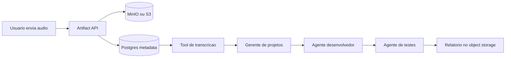

# Object storage e integracao com AIOps

## 1. Resumo

O MinIO presente no `docker-compose.yml` e um object storage compatível com a API do Amazon S3. Ele roda localmente para dar ao ambiente uma camada de armazenamento de objetos sem depender da AWS.

No estado atual deste repositorio, o MinIO esta configurado principalmente como backend de uploads e eventos do Langfuse:

```text
Langfuse web/worker -> API S3 -> MinIO local -> volume langfuse_minio_data
```

Ele ainda nao e usado diretamente pela Edda Agents para armazenar audios, artefatos de workflow ou dados de um datalake.

## 2. MinIO e S3 sao a mesma coisa?

Nao sao o mesmo produto, mas oferecem uma interface compativel:

- **MinIO:** object storage que pode rodar localmente, em Docker ou Kubernetes.
- **Amazon S3:** servico gerenciado da AWS, com durabilidade, escalabilidade, IAM, lifecycle e integracao nativa com outros servicos AWS.
- **API S3-compatible:** contrato usado por clientes e SDKs para gravar buckets e objetos.

O objetivo pratico e poder usar o mesmo adaptador de aplicacao nos dois ambientes:

```text
Desenvolvimento: S3 client -> MinIO
Producao AWS:     S3 client -> Amazon S3
```

As diferencas de endpoint, credenciais, regiao, path-style e algumas features devem ser tratadas por configuracao, nao espalhadas pelo codigo.

## 3. O que deve ir para object storage

Object storage e adequado para arquivos e artefatos grandes, imutaveis ou versionados. Exemplos para os workflows planejados:

- audios enviados para transcricao;
- transcricoes completas;
- documentos originais de RAG;
- arquivos processados e chunks exportados;
- patches e diffs produzidos por um agente desenvolvedor;
- logs de testes e relatorios;
- screenshots, videos e anexos de execucao;
- datasets e resultados de avaliacao;
- exportacoes de traces e relatórios.

Postgres deve guardar o catalogo e os metadados, nao o binario principal:

```text
Postgres:
- artifact_id
- bucket
- object_key
- content_type
- size_bytes
- checksum
- workflow_run_id
- agent_id
- created_at
- retention_until
- classification

MinIO/S3:
- bytes do arquivo
```

Uma referencia de artefato poderia ser:

```json
{
  "artifact_id": "artifact-123",
  "kind": "transcript",
  "bucket": "edda-artifacts",
  "object_key": "runs/run-456/transcript.json",
  "content_type": "application/json",
  "sha256": "...",
  "size_bytes": 18342
}
```

O workflow deve passar referencias e schemas entre agentes, em vez de copiar arquivos grandes dentro do prompt ou do estado do LangGraph.

## 4. MinIO como datalake

O MinIO pode funcionar como uma fundacao de data lake local, mas apenas adicionar MinIO nao cria um datalake completo.

Para um datalake seriam necessarios tambem:

- convencao de buckets e prefixes;
- formatos como Parquet ou JSONL;
- catalogo de dados;
- schemas e evolucao de schema;
- particionamento;
- jobs de ingestao e processamento;
- qualidade e lineage;
- politicas de retencao;
- controle de acesso;
- camada de consulta, como DuckDB, Trino ou Spark, conforme o volume.

Para a Edda Agents, a evolucao mais simples e comecar por um **artifact store**, nao por um datalake geral:

```text
Fase inicial:
MinIO/S3 + Postgres metadata + artifacts por workflow run

Fase analitica:
Object storage + Parquet + catalogo + jobs + engine de consulta
```

Nao e recomendado misturar os objetos do Langfuse com os artefatos de negocio da Edda. Use buckets separados, por exemplo:

- `langfuse` para o Langfuse;
- `edda-artifacts` para entradas e saidas de workflows;
- `edda-evals` para datasets e resultados de avaliacao;
- `edda-exports` para exportacoes temporarias.

## 5. Integracao com o workflow multiagente

No exemplo de audio, o fluxo pode ser:



Boas praticas:

1. Fazer upload do arquivo diretamente para object storage usando URL pre-assinada quando possivel.
2. Validar tamanho, tipo MIME, extensao e checksum.
3. Nunca colocar credenciais de MinIO/S3 no prompt do agente.
4. Entregar ao agente somente um `artifact_id` e uma tool autorizada para ler o objeto.
5. Criar uma nova chave para cada artefato; evitar sobrescrever objetos de runs anteriores.
6. Registrar checksum e tamanho para detectar corrupção ou alteracao.
7. Aplicar retencao e expiração por tipo de artefato.
8. Redigir ou criptografar dados sensiveis quando necessário.
9. Evitar enviar audio bruto para Langfuse; registrar apenas referencia e metadados seguros.

## 6. Agente AIOps e AWS

Sim, e possivel integrar um agente AIOps para executar uma operacao como:

```text
Receber problema
  -> planejar infraestrutura temporaria
  -> criar EC2 e recursos necessarios
  -> executar deploy ou teste
  -> coletar logs e resultados
  -> desligar ou destruir recursos
  -> produzir relatorio e estimativa de custo
```

Mas esse agente nao deve receber acesso administrativo amplo dentro deste repositorio. O melhor desenho e manter o AIOps em um repositorio e ciclo de deploy separados.

### Separacao recomendada

```text
Edda Agents
- agentes genericos
- workflows
- prompts e artefatos
- sandbox local
- API de execucao

Repositorio AIOps
- providers AWS
- Terraform/OpenTofu ou Pulumi
- IAM policies
- state de infraestrutura
- validacao de planos
- deploy, teste e cleanup
- auditoria e guardrails de custo
```

Essa separacao reduz o blast radius, permite versionar infraestrutura de forma independente e evita que um prompt de agente tenha acesso direto a credenciais AWS.

## 7. Como os repositorios devem conversar

A integracao deve acontecer por um contrato explicito, nao por importacao direta de codigo entre os repositorios.

### Opcao A - API do AIOps

A Edda envia uma requisicao para o AIOps:

```http
POST /v1/infrastructure/runs
```

```json
{
  "request_id": "run-456",
  "environment": "ephemeral-test",
  "plan_ref": "s3://edda-artifacts/runs/run-456/infra-plan.json",
  "actions": [
    "create_ec2",
    "create_s3_test_bucket",
    "run_tests",
    "collect_results",
    "cleanup"
  ],
  "max_budget_usd": 2.00,
  "ttl_minutes": 90,
  "require_approval": true
}
```

O AIOps retorna um `operation_id` e a Edda acompanha o status:

```http
GET /v1/infrastructure/runs/{operation_id}
```

### Opcao B - Fila/eventos

Para operações longas, o AIOps pode consumir uma fila e publicar eventos:

```text
Edda -> infrastructure.requested
AIOps -> infrastructure.provisioning
AIOps -> infrastructure.test_completed
AIOps -> infrastructure.cleanup_completed
AIOps -> infrastructure.failed
```

A fila e preferivel quando a operacao pode durar mais que o timeout de uma requisicao HTTP ou precisa ser retomada.

### Opcao C - GitOps

A Edda gera uma especificacao ou pull request. O repositorio AIOps valida e aplica via pipeline:

```text
Edda gera declaracao
  -> Pull Request
  -> plan Terraform/OpenTofu
  -> aprovacao
  -> apply
  -> testes
  -> destroy
```

Para infraestrutura AWS real, esta e frequentemente a opcao mais auditavel. O agente propoe; o pipeline controlado executa.

## 8. EC2, S3, testes e cleanup

O fluxo temporario e possivel, mas “desligar o servidor” nao significa necessariamente custo zero.

### Stop da EC2

Ao parar uma EC2:

- o custo de computacao normalmente deixa de ser cobrado;
- volumes EBS continuam gerando custo;
- Elastic IP publico pode gerar custo quando nao esta associado conforme as regras da AWS;
- snapshots, logs, buckets e outros recursos continuam existindo;
- recursos dependentes podem continuar cobrando.

### Terminate da EC2

Para ambientes realmente efemeros, `terminate` costuma ser mais seguro do ponto de vista de cleanup, desde que:

- volumes e recursos dependentes tenham politica clara;
- dados importantes tenham sido enviados para S3;
- logs e resultados tenham sido coletados;
- o ambiente seja recriavel por IaC.

### S3 de teste

O bucket temporario deve ter:

- nome com `request_id`;
- lifecycle de expiracao;
- bloqueio de acesso publico;
- encryption;
- policy que permita somente o run correspondente;
- cleanup explicitamente verificado.

### Guardrails obrigatorios

Antes de provisionar:

- validar allowlist de regioes e tipos de instancia;
- impor `max_budget_usd`;
- impor `ttl_minutes`;
- exigir tags como `owner`, `request_id`, `expires_at` e `environment`;
- executar `plan` antes de `apply`;
- exigir aprovacao humana para recursos fora da allowlist;
- usar IAM com menor privilegio;
- aplicar timeout e rollback/cleanup;
- publicar alerta quando o cleanup falhar.

## 9. Terraform/OpenTofu e estado

O AIOps deve preferir IaC para recursos persistentes e ambientes efemeros:

- Terraform ou OpenTofu para declaracao;
- state remoto protegido, quando necessario;
- locking do state;
- workspace ou stack separado por ambiente;
- plano salvo como artefato;
- apply e destroy rastreaveis;
- politica para impedir recursos sem tags e TTL.

Nao e recomendavel um agente executar comandos AWS arbitrarios construidos livremente pelo LLM. O agente deve produzir uma declaracao validada, e um executor deterministico deve aplicar somente operacoes permitidas.

## 10. Fronteira de seguranca

O AIOps nao deve ser apenas mais uma tool com acesso ao socket Docker e credenciais AWS dentro do backend da Edda.

Separar os repositorios nao basta; tambem e necessario separar:

- credenciais;
- IAM roles;
- contas ou ambientes AWS;
- pipelines de deploy;
- auditoria;
- limites de custo;
- aprovadores.

A Edda deve enviar uma intencao declarativa. O AIOps deve validar, planejar, pedir aprovacao quando necessario, executar e limpar.

## 11. Arquitetura recomendada

Para este projeto:

```text
Edda Agents
    API/workflow run
        |
        | contrato assinado + request_id + artifact refs
        v
AIOps Service/Pipeline
    Policy validation
        -> Terraform/OpenTofu plan
        -> approval quando necessario
        -> AWS apply
        -> tests
        -> artifact/log collection
        -> AWS cleanup
        -> status callback
```

O Langfuse pode registrar o trace de raciocinio e das chamadas do workflow, mas nao deve ser a fonte de verdade do estado da infraestrutura. O AIOps deve manter o estado operacional da mudança e a auditoria de infraestrutura.

## 12. Roadmap de integracao

### A1 - Contrato sem AWS

- [ ] Definir `InfrastructureRunRequest` e `InfrastructureRunStatus`.
- [ ] Criar um mock AIOps local.
- [ ] Simular `provisioning -> testing -> cleanup -> completed`.
- [ ] Armazenar planos e relatorios como artefatos locais.
- [ ] Propagar `request_id`, `run_id` e `trace_id`.

### A2 - Artifact store

- [ ] Criar bucket dedicado da Edda no MinIO.
- [ ] Criar tabela de metadata de artefatos.
- [ ] Implementar upload/download via API e URLs pre-assinadas.
- [ ] Adicionar checksum, tamanho, content type e retencao.
- [ ] Separar bucket da Edda do bucket do Langfuse.

### A3 - AIOps em ambiente de teste

- [ ] Criar repositorio ou servico AIOps separado.
- [ ] Usar uma conta AWS sandbox.
- [ ] Criar IAM role restrita.
- [ ] Provisionar uma EC2 pequena com TTL e tags obrigatorias.
- [ ] Criar bucket S3 temporario com lifecycle.
- [ ] Executar teste controlado.
- [ ] Coletar logs e resultados.
- [ ] Fazer destroy e validar ausencia de recursos.

### A4 - Integracao auditavel

- [ ] Integrar via API assinada, fila ou GitOps.
- [ ] Exigir plan antes de apply.
- [ ] Exigir aprovacao para ações de maior risco.
- [ ] Registrar custo estimado e custo real quando disponível.
- [ ] Alertar cleanup incompleto.
- [ ] Adicionar testes de policy e chaos/failure cleanup.

## 13. Decisao recomendada

Manter o AIOps em um repositorio separado e integrar por contrato. A Edda Agents deve ser responsavel por composicao de agentes, workflows, artefatos e solicitacoes. O AIOps deve ser responsavel por AWS, IaC, IAM, provisionamento, testes de infraestrutura e cleanup.

O MinIO pode ser usado agora como S3 local para artefatos da Edda, mas deve receber buckets separados do Langfuse. Quando o fluxo for para AWS, o mesmo contrato pode apontar para S3, com IAM, lifecycle e encryption adequados.

O primeiro passo seguro nao e criar uma EC2 real a partir de um prompt. E criar um mock AIOps com o mesmo contrato, testar o ciclo completo de provisionamento e cleanup, e somente depois habilitar uma conta sandbox com limites de custo e aprovacao.
